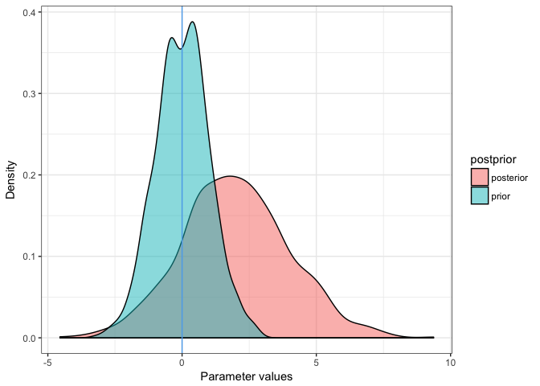

<!-- README.md is generated from README.Rmd. Please edit that file -->
LRO.utilities
=============

R package: Utility functions and addins for RStudio.

Helper tools I use in many projects.

By Ludvig R. Olsen,
Cognitive Science, Aarhus University.
Started in Feb. 2017

Contact at:
<r-pkgs@ludvigolsen.dk>

Main functions:

-   polynomializer
-   %ni%
-   insertPipe (Addin)
-   scaler, scaler\_, scaler\_fit, scaler\_fit\_, scaler\_transform, scaler\_invert
-   binarizer, binarizer\_
-   rename\_col
-   savage\_dickey

Installation
------------

Development version:

> install.packages("devtools")
>
> devtools::install\_github("LudvigOlsen/LRO.utilities")

Use
---

### Addins

-   Install package.
-   Add key command by going to:
    -   *Tools* &gt; *Addins* &gt; *Browse Addins* &gt; *Keyboard Shortcuts*.
    -   Find **Insert %&gt;%** and press its field under *Shortcut*.
    -   Press desired key command.
    -   Press *Apply*.
    -   Press *Execute*.
-   Press chosen key command inside R Markdown document.

### Examples

``` r
# Attach packages
library(LRO.utilities)
library(dplyr) # %>% 
library(knitr) # kable()
library(ggplot2)
```

------------------------------------------------------------------------

#### polynomializer

Exponentiate vectors to make polynomials of degree 2 to degree.

E.g. create columns v^2, v^3, v^4...

``` r
# On vector

vect <- c(1,3,5,7,8)

polynomializer(vect, degree = 3) %>% 
  kable()
```

|  vect|  vect\_2|  vect\_3|
|-----:|--------:|--------:|
|     1|        1|        1|
|     3|        9|       27|
|     5|       25|      125|
|     7|       49|      343|
|     8|       64|      512|

``` r

# On vectors in dataframe

data <- data.frame(vect = vect,
                   bect = vect*3,
                   dect = vect*5)

polynomializer(data, 
               cols = c('bect','dect'), 
               degree = 3) %>% 
  kable()
```

|  vect|  bect|  dect|  bect\_2|  bect\_3|  dect\_2|  dect\_3|
|-----:|-----:|-----:|--------:|--------:|--------:|--------:|
|     1|     3|     5|        9|       27|       25|      125|
|     3|     9|    15|       81|      729|      225|     3375|
|     5|    15|    25|      225|     3375|      625|    15625|
|     7|    21|    35|      441|     9261|     1225|    42875|
|     8|    24|    40|      576|    13824|     1600|    64000|

------------------------------------------------------------------------

#### %ni%

"Not in"

``` r

c(1,3,5) %ni% c(2,3,6)
#> [1]  TRUE FALSE  TRUE
```

------------------------------------------------------------------------

#### scaler

Center and/or scale multiple columns of a dataframe.

**scaler** is designed to work with %&gt;% pipelines.

**scaler\_fit** returns fit\_object with information used to transform data.

**scaler\_transform** scales data based on the information in the fit\_object.

**scaler\_invert** inverts scaling based on the information in the fit\_object.

**scaler\_** and **scaler\_fit\_** are standard evalution versions.

``` r

# Scale and center 'vect' and 'bect' 
# in dataframe from previous example
scaler(data, vect, bect) %>% 
  kable()
```

|        vect|        bect|  dect|
|-----------:|-----------:|-----:|
|  -1.3270176|  -1.3270176|     5|
|  -0.6285873|  -0.6285873|    15|
|   0.0698430|   0.0698430|    25|
|   0.7682733|   0.7682733|    35|
|   1.1174885|   1.1174885|    40|

``` r

# Only scaling 'vect'  - working in pipeline
data %>% 
  scaler(vect, center = F) %>% 
  kable()
```

|       vect|  bect|  dect|
|----------:|-----:|-----:|
|  0.3492151|     3|     5|
|  1.0476454|     9|    15|
|  1.7460757|    15|    25|
|  2.4445060|    21|    35|
|  2.7937212|    24|    40|

``` r

# Only center 'bect' and 'dect' 
# selecting with column index range
data %>% 
  scaler(2:3, scale = F) %>% 
  kable()
```

|  vect|   bect|  dect|
|-----:|------:|-----:|
|     1|  -11.4|   -19|
|     3|   -5.4|    -9|
|     5|    0.6|     1|
|     7|    6.6|    11|
|     8|    9.6|    16|

##### Fit / Transform / Invert

``` r
# Fit scaler
fitted_scaler <- data %>% 
  scaler_fit()

fitted_scaler %>% kable()
```

| column |  mean|         sd| center | scale |
|:-------|-----:|----------:|:-------|:------|
| vect   |   4.8|   2.863564| TRUE   | TRUE  |
| bect   |  14.4|   8.590693| TRUE   | TRUE  |
| dect   |  24.0|  14.317821| TRUE   | TRUE  |

``` r

# Transform data
scaled_df <- data %>% 
  scaler_transform(fit_object = fitted_scaler)

scaled_df %>% kable()
```

|        vect|        bect|        dect|
|-----------:|-----------:|-----------:|
|  -1.3270176|  -1.3270176|  -1.3270176|
|  -0.6285873|  -0.6285873|  -0.6285873|
|   0.0698430|   0.0698430|   0.0698430|
|   0.7682733|   0.7682733|   0.7682733|
|   1.1174885|   1.1174885|   1.1174885|

``` r

# Invert scaling
scaled_df %>% 
  scaler_invert(fit_object = fitted_scaler) %>% 
  kable()
```

|  vect|  bect|  dect|
|-----:|-----:|-----:|
|     1|     3|     5|
|     3|     9|    15|
|     5|    15|    25|
|     7|    21|    35|
|     8|    24|    40|

------------------------------------------------------------------------

#### binarizer

Binarize multiple columns of a dataframe based on a given threshold.

**binarizer** is designed to work with %&gt;% pipelines.

**binarizer\_** is a standard evalution version.

``` r

scaled_df %>% 
  binarizer(thresh = 0)
#> # A tibble: 5 × 3
#>    vect  bect  dect
#>   <dbl> <dbl> <dbl>
#> 1     0     0     0
#> 2     0     0     0
#> 3     1     1     1
#> 4     1     1     1
#> 5     1     1     1
```

------------------------------------------------------------------------

#### rename\_col

Rename single column in dataframe. This is a bit like plyr::rename just only for 1 column at a time.

``` r
rename_col(data, 
           old_name = 'bect', 
           new_name = 'sect') %>% 
  kable()
```

|  vect|  sect|  dect|
|-----:|-----:|-----:|
|     1|     3|     5|
|     3|     9|    15|
|     5|    15|    25|
|     7|    21|    35|
|     8|    24|    40|

#### savage\_dickey

Calculate Bayes factor from 2 distributions and plot the the two distributions.

Returns list with ggplot2 object, BF10, and BF01.

``` r
prior <- rnorm(1000, mean=0, sd=1)
posterior <- rnorm(1000, mean=2, sd=2)

s_d <- savage_dickey(posterior, prior, Q = 0, plot = TRUE)

s_d$BF10
#> [1] 0.3158816

s_d$BF01
#> [1] 3.165744

s_d$post_prior_plot +
  theme_bw()
```


